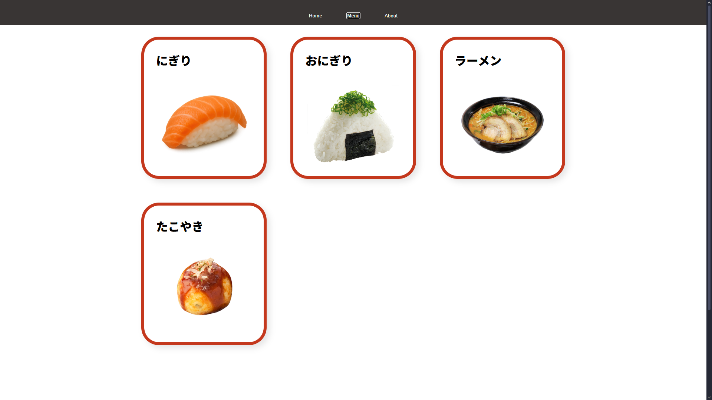

# Restaurant Page

The goal is to practice DOM manipulation by dynamically rendering a simple restaurant website using JavaScript only (no direct HTML editing after initial setup).

## Objectives

- Use JavaScript to generate all page content.
- Structure the project using ES6 modules.
- Implement tabbed navigation (e.g., Home, Menu, Contact).
- Bundle the project using a module bundler (like Webpack).
- Apply best practices for file organization and code readability.

## Features

- Dynamic content rendering for each tab.
- Responsive and clean design.
- Modular code structure.

## Project Previews

[Live Preview](https://vicker14.github.io/restaurant-page/)

